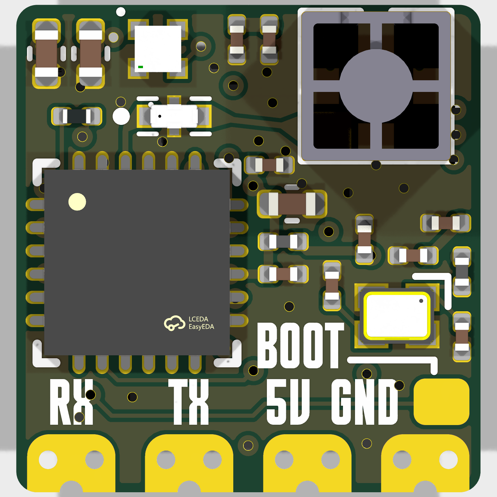
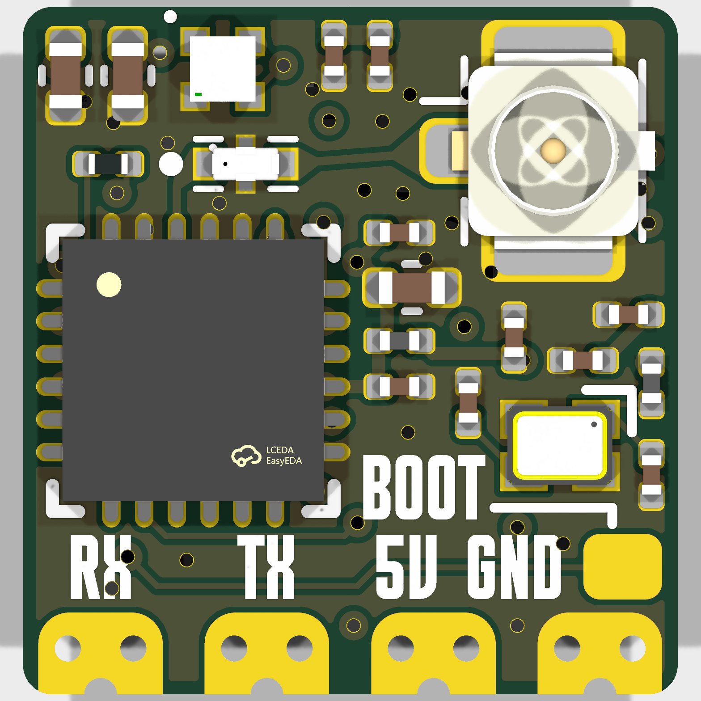
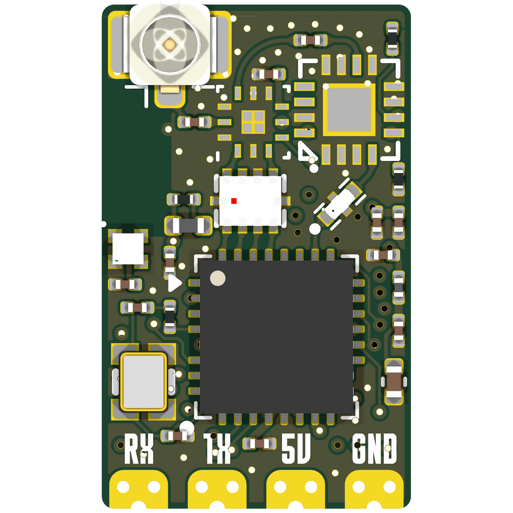
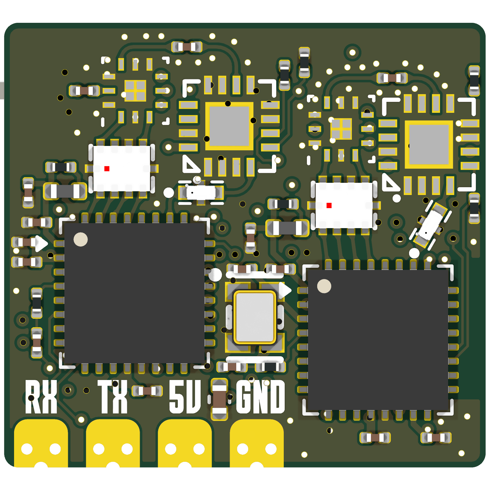
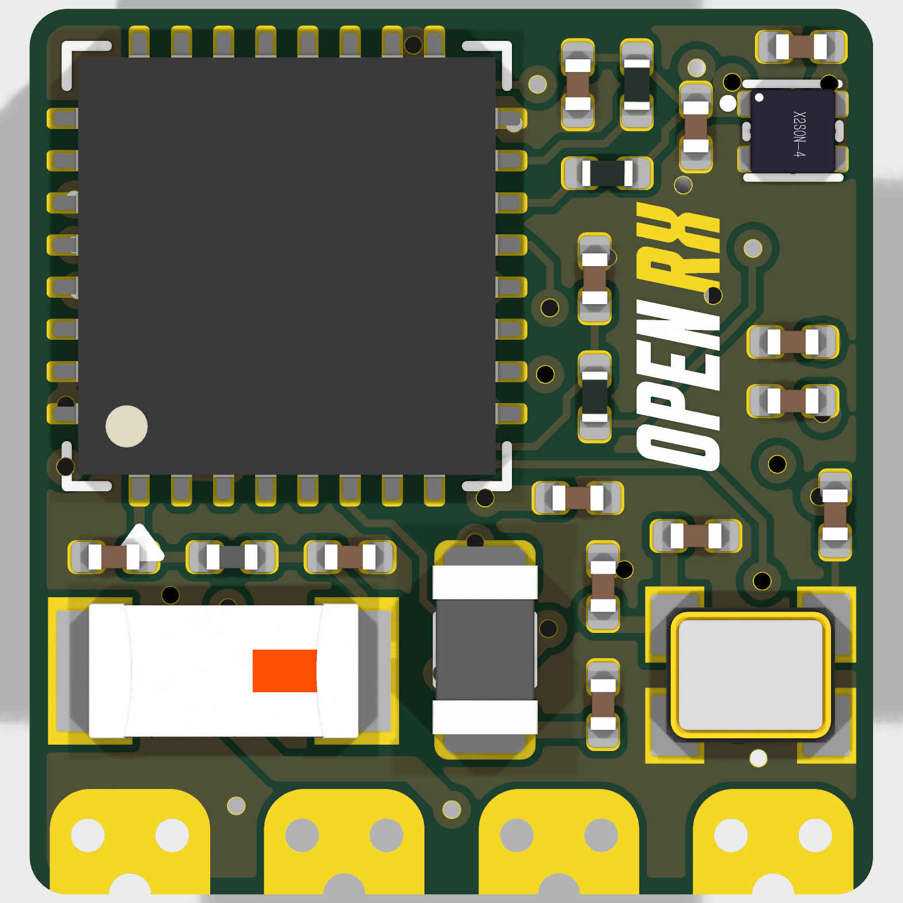
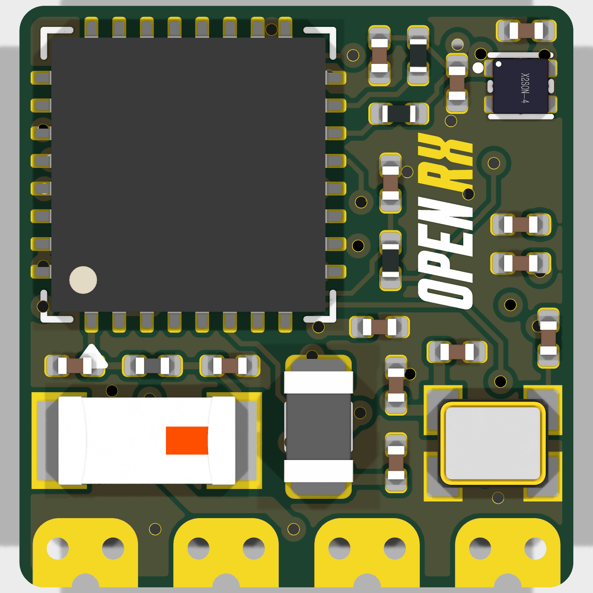
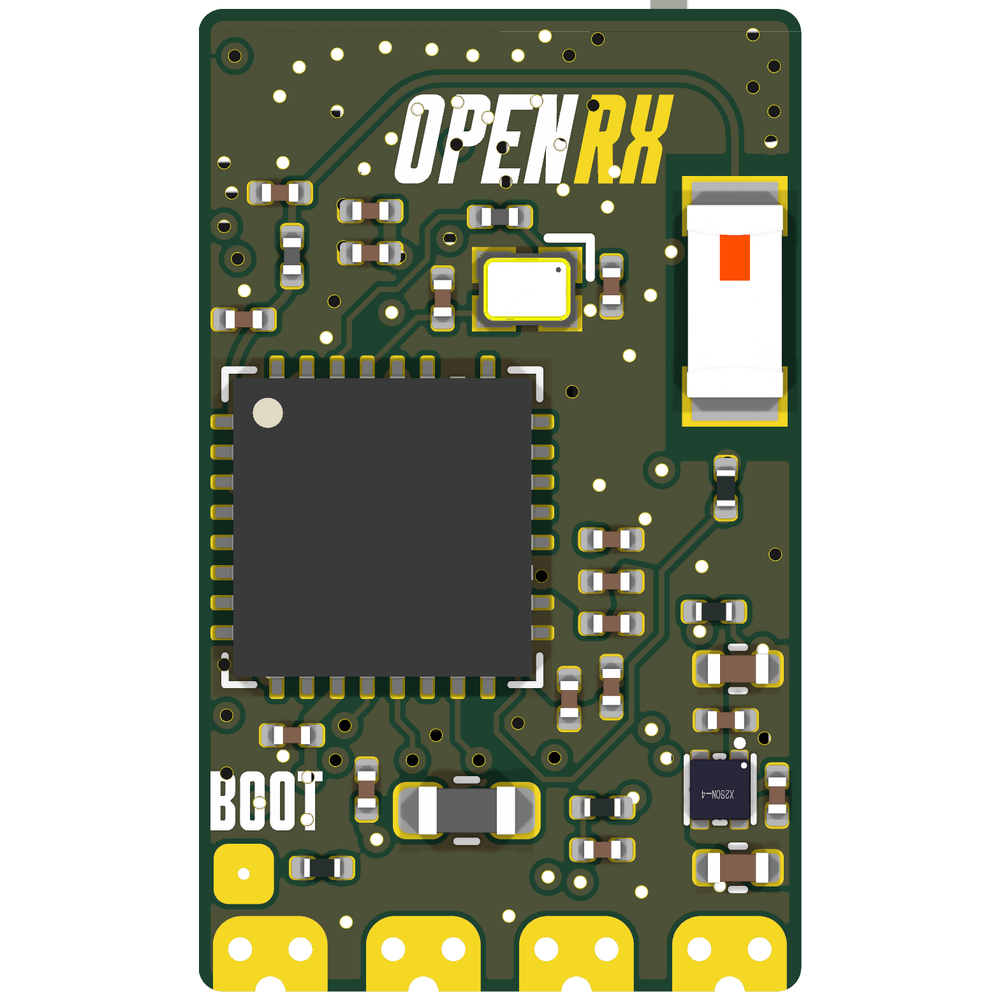
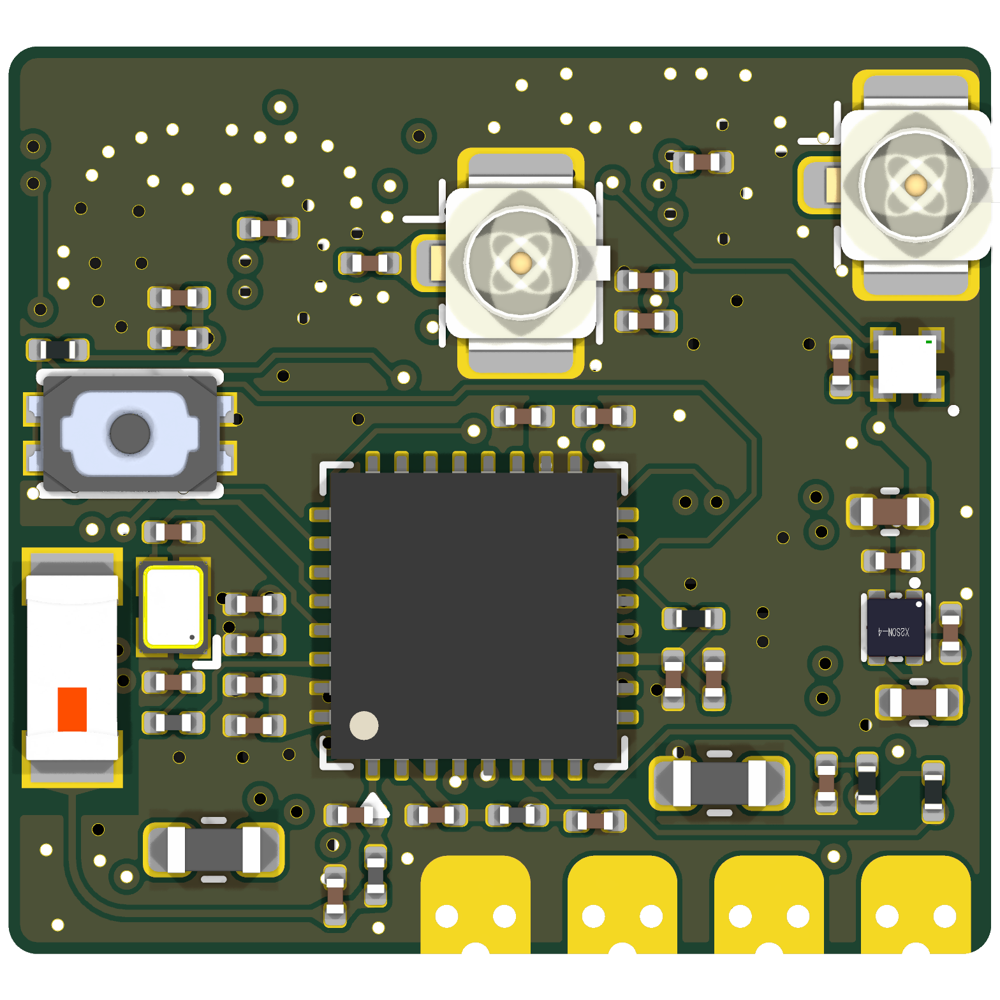

# OpenRX

Open-source **ExpressLRS (ELRS) receiver** line for FPV/RC. Four board variants share one **Espressif ESP32-C3** core, an on-board **TLV75533** 3.3 V LDO, and the upstream ExpressLRS firmware; they differ only in radio IC, frequency band, RF front-end, and ELRS antenna. All four are 6-layer.

| | | | |
|:---:|:---:|:---:|:---:|
| **Lite** | **Lite-UFL** | **Mono** | **Gemini** |
|  |  |  |  |
|  |  |  |  |
| SX1281, 2.4 GHz, chip antenna | SX1281, 2.4 GHz, U.FL | LR1121, dual-band, U.FL | 2× LR1121, dual-radio, 2× U.FL |

> 📖 This README is the canonical board reference. Per-sheet engineering rationale (mirrored from the on-canvas KiCad comments) is in [`DESIGN_NOTES.md`](DESIGN_NOTES.md); each variant also has its own `DESIGN.md`. Build, flashing, and bring-up notes belong in the project wiki.

## Variants

| Variant | Radio IC | Band | ELRS antenna | RF front-end | Size | Layers |
|---|---|---|---|---|---|---|
| **Lite** | Semtech SX1281 | 2.4 GHz | On-board chip antenna (Molex 47948-0001, AE2) | 2450FM07D0034T band-pass filter (FL1) | 10.05 × 10.55 mm | 6 |
| **Lite-UFL** | Semtech SX1281 | 2.4 GHz | U.FL connector (J1) | 2450FM07D0034T band-pass filter (FL1) | 10.05 × 10.55 mm | 6 |
| **Mono** | Semtech LR1121 | Sub-GHz + 2.4 GHz | U.FL connector (J1) | RFX2401C PA/LNA (U4) + SKY13373-460LF RF switch (U5) + 0900PC16J0042001E balun/IPD (T1) + 2450FM07D0034T BPF (FL1) | 10.05 × 16.35 mm | 6 |
| **Gemini** | 2× Semtech LR1121 | Sub-GHz + 2.4 GHz, dual-radio (Xrossband) | 2× U.FL connector (J1, J2) | 2× (RFX2401C + SKY13373-460LF + 0900PC16J0042001E + 2450FM07D0034T) | 17.05 × 15.75 mm | 6 |

**Antenna notes** (verified from the schematic net labels):
- Every variant carries a **2450AT18A100E ceramic chip antenna (AE1)** on the net `WIFI` — this is the **ESP32-C3 Wi-Fi antenna** used for OTA flashing/config, *not* the ELRS link antenna.
- The **ELRS link antenna** is fed from the radio's RF output through the band-pass filter (`FL1-OUT`): on **Lite** it terminates at the Molex **47948-0001** chip antenna (AE2); on **Lite-UFL / Mono / Gemini** it terminates at the **U.FL** connector(s).
- **Mono** and **Gemini** share one firmware binary; the second radio's `radio_nss_2`/`radio_rst_2` mapping in the Gemini target JSON enables dual-radio (Xrossband) mode.

## Common specifications

- **MCU:** Espressif **ESP32-C3** (QFN-32, 5×5 mm), U1. GPIO 9 is the BOOT/strapping pin.
- **LDO:** **TLV75533PDQNR** (U2, X2SON-4) — 5 V on the `5V` pad → 3.3 V rail. On-canvas note: *“5 V → 3.3 V, 238 mV @ 500 mA maximum dropout.”*
- **Clock:**
  - ESP32-C3 crystal **CJ17-400001010B20** (X1, 40 MHz) — all variants.
  - Radio **TCXO**: **OW7EL89CENUNFAYLC-52M** (OSC1, 52 MHz) on the SX1281 variants (Lite, Lite-UFL); **OW7EL89CENUYO3YLC-32M** (OSC1, 32 MHz) on the LR1121 variants (Mono, Gemini). On Gemini the single TCXO (`clock.kicad_sch`) is shared by both radios.
- **Status LED:** WS2812B RGB (**XL-1010RGBC-WS2812B**, D1), powered from +3.3 V. LED signal GPIO differs by variant (see [Pin map](#pin-map)).
- **Telemetry / control:** CRSF over the ESP32-C3 UART0 (`U0RXD`/`U0TXD`).
- **Power input:** 5 V on the `5V` solder pad.
- **Flashing:** UART, Wi-Fi OTA, or Betaflight passthrough (per the ELRS target JSON).

## I/O pads & button

Solder pads carry the external interface. Pad → net mapping is derived directly from the schematic netlists:

| Pad | Net | ESP32-C3 | Function |
|---|---|---|---|
| `RX` (TP1) | `U0RXD` | GPIO 20 | CRSF / serial in to RX |
| `TX` (TP2) | `U0TXD` | GPIO 21 | CRSF / serial out / telemetry |
| `5V` (TP3) | `+5V` | — | 5 V supply in → TLV75533 LDO |
| `GND` (TP4) | `GND` | — | Ground |
| `BOOT` (TP5) | `BOOT` | GPIO 9 | Pull low at power-up for UART download mode |

- **Lite, Lite-UFL, Mono:** `BOOT` is a solder pad (TP5).
- **Gemini:** the BOOT/GPIO 9 function is a populated **tactile button** (U9, TS2306A) instead of a pad; the `RX`/`TX`/`5V`/`GND` pads remain.

## Pin map

The radio interface and per-variant GPIO assignments come from the in-repo ExpressLRS target JSON (`shared/elrs-targets/`):

| Function | Lite / Lite-UFL | Mono | Gemini |
|---|---|---|---|
| Serial RX / TX | 20 / 21 | 20 / 21 | 20 / 21 |
| Radio SCK / MOSI / MISO | 4 / 7 / 6 | 6 / 4 / 5 | 6 / 4 / 5 |
| Radio NSS / RST | 8 / 2 | 7 / 2 | 0 / 2 |
| Radio BUSY / DIO1 | 3 / 5 | 3 / 1 | 3 / 1 |
| Radio 2 NSS / RST / BUSY / DIO1 | — | — | 7 / 10 / 8 / 18 |
| RF switch control | — | GPIO 15/8/14/13 | GPIO 15/8/14/13 |
| Status LED | 10 | 8 | 19 (GRB) |
| BOOT / button | 9 | 9 | 9 |
| Max TX power | 13 dBm | 12–22 dBm | 12–22 dBm/radio |

## Repository structure

```
OpenRX/
├── OpenRX-Lite/          SX1281 2.4 GHz, on-board chip antenna
├── OpenRX-Lite-UFL/      SX1281 2.4 GHz, U.FL
├── OpenRX-Mono/          single LR1121 dual-band, U.FL
├── OpenRX-Gemini/        dual LR1121 dual-band, 2× U.FL
│                         (each variant: .kicad_pro/.kicad_sch/.kicad_pcb,
│                          DESIGN.md, export/ or production/ fab output)
├── shared/
│   ├── libs/             OpenRX-Shared.kicad_sym / .pretty / .3dshapes (project-local)
│   ├── sheets/           shared hierarchical sheet (RX core, legacy)
│   └── elrs-targets/     ExpressLRS hardware-target JSON + targets_entries.json
├── images/               board renders (front/back, all four variants)
├── datasheets/common/    local datasheet cache for active ICs/RF parts
├── exports/              schematic PDFs (per variant + ELRS-team drops)
├── verification/         BOM and design-verification scripts
└── archive/legacy-projects/  retired designs (Nano, 900, PWM, Dual, …)
```

KiCad 9/10 project files; **project-local libraries only** (no global library dependencies) via `${KIPRJMOD}/../shared/libs/`. Symbols carry an `LCSC` property for JLCPCB BOM export.

Schematic hierarchy per variant:
- **Lite / Lite-UFL:** `OpenRX-*.kicad_sch` (top) → `esp32c3_sx1281_lite.kicad_sch` (ESP32-C3 + SX1281 + LDO + RGB LED).
- **Mono:** `OpenRX-Mono.kicad_sch` (top) → `esp32c3_lr1121_mono.kicad_sch`.
- **Gemini:** `OpenRX-Gemini.kicad_sch` (top) → `esp32-c3.kicad_sch` + `clock.kicad_sch` + `lr1121.kicad_sch` (instantiated ×2).

## Firmware

Upstream ExpressLRS targets (`shared/elrs-targets/`):

| Variant | Product name | ELRS firmware target | Platform | Upload |
|---|---|---|---|---|
| Lite | OpenRX Lite 2.4GHz RX | `Unified_ESP32C3_2400_RX` | esp32-c3 | UART · Wi-Fi · Betaflight |
| Lite-UFL | OpenRX Lite-UFL 2.4GHz RX | `Unified_ESP32C3_2400_RX` | esp32-c3 | UART · Wi-Fi · Betaflight |
| Mono | OpenRX Mono Dual Band RX | `Unified_ESP32C3_LR1121_RX` | esp32-c3 | UART · Wi-Fi · Betaflight |
| Gemini | OpenRX Gemini XrossBand RX | `Unified_ESP32C3_LR1121_RX` | esp32-c3 | UART · Wi-Fi · Betaflight |

Minimum ExpressLRS version **3.5.0**. Hardware pin maps live in the per-variant target JSON.

## Manufacturing

Fab outputs live under each variant's `export/` or `production/` directory (JLCPCB BOM, designator, and position CSVs plus gerber ZIPs); these are generated with the KiCad Fabrication Toolkit and are gitignored as re-exportable. Prefer LCSC basic parts for assembly.

## License

Hardware: **CERN Open Hardware Licence Version 2 — Strongly Reciprocal** ([CERN-OHL-S-2.0](https://ohwr.org/cern_ohl_s_v2.txt)). See [LICENSE](LICENSE).
