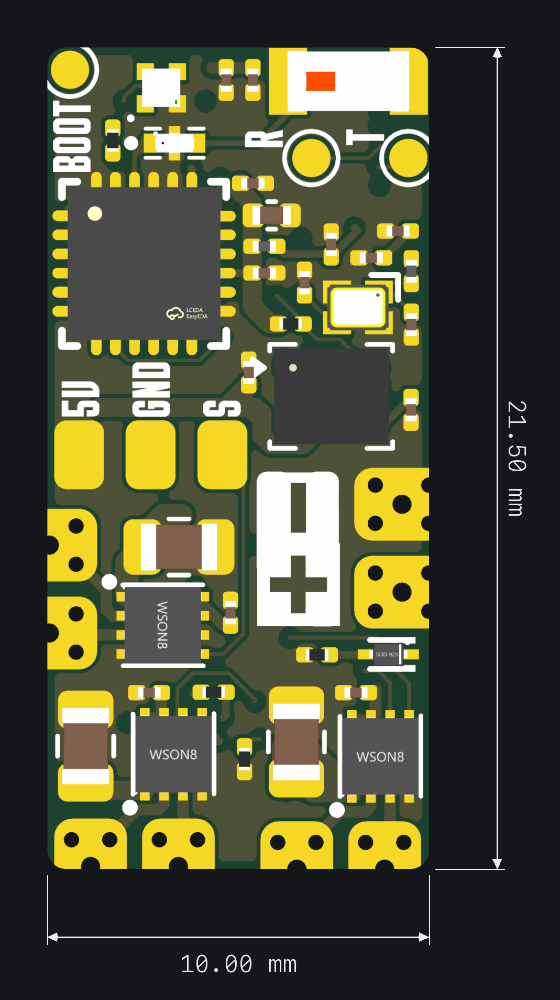
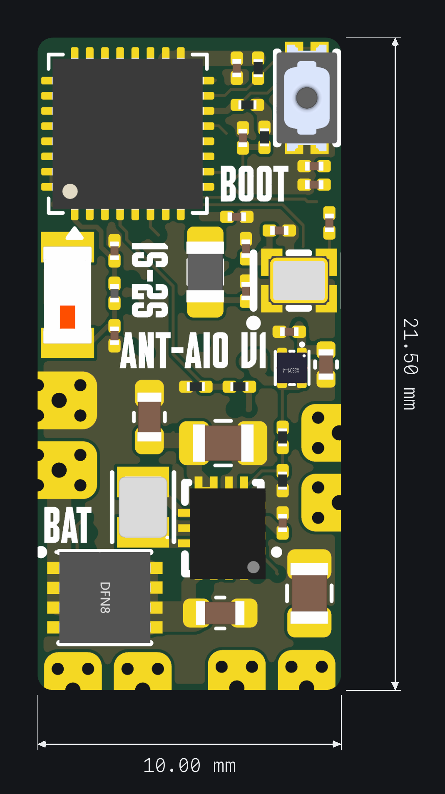

# AntAIO — design summary

Antweight / beetleweight combat-robot all-in-one: ExpressLRS 2.4 GHz receiver +
6-axis IMU + triple brushed-DC ESC on one 10.00 × 21.50 mm, 6-layer board. Built
on the OpenRX-Lite ELRS core (ESP32-C3 + SX1281).

For the full part list, pin map, I/O pads and architecture see the top-level
[README](../README.md). For the verified open/done design issues see
[REVIEW.md](REVIEW.md) and [CHANGELIST.md](../CHANGELIST.md).

## Board preview

| Front | Back |
|-------|------|
|  |  |

## Schematic

- Root sheet: `AntAIO.kicad_sch` → ELRS core sub-sheet `esp32c3_sx1281_lite.kicad_sch`
- RF chain: `SX1281 RFIO → 2450FM07D0034 (FL1, 2.4 GHz BPF) → link antenna`
- ESP32-C3 Wi-Fi → AE1 (2450AT18A100E) for OTA config
- Power: AON7407 reverse P-FET → TPS63070 buck-boost (+5 V) → TLV75533 LDO (+3V3)
- Motors: 3× DRV8212 H-bridge (2 drive + 1 weapon), VM = +BATT

## Firmware

- ELRS link target: `Unified_ESP32C3_2400_RX` (≥ 3.5.0)
- Hardware JSON: `../shared/elrs-targets/OpenRX Lite 2400.json`
- Combat-robot mixing / IMU stabilization / motor PWM are application firmware on
  top of ELRS (separate; not in this hardware repo)

## Flash interface

- Pads: `5V` (or `5U`), `GND`, `R`/`T` (U0RXD/U0TXD)
- `BOOT`: hold low at power-up for UART download mode
- Wi-Fi OTA after the first wired flash
- **Flash with the motor battery disconnected** — `R`/`T` are also the right-drive lines

## Sourcing

LCSC basic/preferred parts where possible. Key RF/active parts:

- `C2651081` 2450FM07D0034 — 2.4 GHz bandpass filter (FL1)
- `C2151551` SX1281IMLTRT — link radio (watch stock for volume runs)
- DRV8212DSGR ×3 — brushed H-bridges
- TPS63070RNMR — buck-boost; TLV75533PDQNR — 3.3 V LDO
